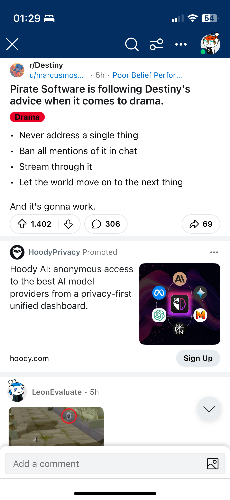

# Destiny

- [Tump needs to tell people to calm down.](https://youtu.be/_mMAUqJ-7qg?si=DK_IF8KEgEj_edIY&t=1025)

Things that I clipped while watching/reading/reacting to his content.

- [Obsidian notes](https://publish.obsidian.md/destiny/)
- [Elon's Neuralink Breakthrough And Telepathy Is Actually Awesome](https://youtu.be/ha1h_ajPFNk?si=3ISzlZI1NPUL184I)
- Pirate Software is following Destiny's advice when it comes to drama: never address a single thing, ban all mentions of it in chat, stream through it, let the world move on the next thing
- Leftist Are Trying To Fight Back With "Dark Woke"
    - [a good people in wheelchair analogy](https://youtu.be/1TpN093bdAU?si=ae3ktEeYVMOTWnCP)
- [Principles](https://youtu.be/RlJ6uNk15Gc?si=_ec9ZTyg-hCDiEsD&t=4423)
- [Non-binary might be the easiest to fake](https://youtu.be/aH8iFzeEMa8?si=LvlkLh7UarhW_4bP)
- [Download more ram](https://youtu.be/rfRDwMh1Ht8?si=_bjHZy7hRtxnWBY7) convinces
- [Destiny: The only person fit for the internet | A career documentary](https://youtu.be/lyZUqjgUQ6k?si=Vya6ZxJEfVbdj6o9)

[`Sun, 14 Jul`](day://2024.07.14) Destiny was fighting [Jordan Peterson](craftdocs://open?blockId=88E0DD67-91FD-4724-96B9-586285AEC534&spaceId=78991a71-3e99-e195-9b3c-47bb26f1e234) and [Jordan Peterson](craftdocs://open?blockId=88E0DD67-91FD-4724-96B9-586285AEC534&spaceId=78991a71-3e99-e195-9b3c-47bb26f1e234) was fighting [Andrew Tate](craftdocs://open?blockId=F80346ED-3527-4D46-BC27-EC43AC235B7D&spaceId=78991a71-3e99-e195-9b3c-47bb26f1e234). Basically [Jordan Peterson](craftdocs://open?blockId=88E0DD67-91FD-4724-96B9-586285AEC534&spaceId=78991a71-3e99-e195-9b3c-47bb26f1e234) was fighting both. 

Destiny's tweet after Trump's assassination attempt: 

*If we learned anything today, I hope it’s realizing the importance of principles I’ve stressed many times on stream before: having a firearm means absolutely nothing if you don’t spend time at the range practicing with it.*

see **[On being Edgy](craftdocs://open?blockId=5255D96C-AC0C-4B40-8CF0-F57CD54E0721&spaceId=78991a71-3e99-e195-9b3c-47bb26f1e234)**

- [the same in real life, fierce, business like, speaks purposefully, intimidating presence, intense, dose not lose stamina](https://www.youtube.com/watch?v=1rGPzrHtodI&t=617s)
    - [starts at atround 5:30](https://www.youtube.com/live/1rGPzrHtodI?si=Zh5-8fO67wvDrIff&t=329)
- [Should Destiny be platforming far-right extremists? | Arguing with Chris from Decoding the Gurus](https://youtu.be/KGZGOrk2GMw?si=5ZL1j_vt5rOChcsM)

+ **Rhetorical strategies 🌵**
    - Epistemic/aesthetic flaws
        - "Just asking questions"
            - Predict the contour of the conversation
            - Ask questions, and force them to take a hard position.
    - Diction: Big and small terms "BIG anything" "Deep state"
        - Ask who the deep state is, force them to relate them to the topic at hand.
    - Characterization - different tragic hero tropes, for instance. The creator of the conspiracy theory will often portray themselves in this way.
        - Ask more and more questions about the person's character.
    - "Do it yourself" - stuff conveyed in newsletters, pamphlets, "man on the street" kind of vibe.
        - Ask why they made the choices they did when it comes to presentation.
    - Lots of "shape-talk, charts and stuff, mapping

    

    Nathan mentioned in the debate (paraphrasing): "if you are separating people who conveniently have a different race, and you give them less rights while they have a different race, that is apartheid." You replied by saying it was about citizenship, not race; ergo, not apartheid.

    A good analogy here is something [Scott Alexander](craftdocs://open?blockId=1D4123D5-DFAA-43D5-9A0F-52A519436C0B&spaceId=78991a71-3e99-e195-9b3c-47bb26f1e234) has written about: maybe negative impacts on black people are not because the criminal system is racist, but because it is biased against poor people. The problem with saying "it is racist because it disproportionately impacts black people" is that, while ostensibly close to the truth, it is very misleading. All of a sudden you don't care as much about improving economic conditions and opportunities, or dealing with jury bias, but are distracted by things like implicit bias/racism training/caring about what the media will say in reaction to an arrest, etc.

    I consider this a subtle use of the noncentral fallacy, which I know you hate.

        

- [Stumping on Tate](https://youtube.com/shorts/yVc2FrtQCGY?si=vNGdnZL27olAlruA)
- [Dr. K](craftdocs://open?blockId=E195681D-8676-4CC4-8B63-0C1160C8AA48&spaceId=78991a71-3e99-e195-9b3c-47bb26f1e234) does not think Destiny is a sociopath
    - [do you think you are a sociopath?](https://youtu.be/3bn8UPZPG9k?si=3PWNDEJsj0x1H9gm&t=5592)
    - your coldness is actually compassionate as you do not want to make other people feel unhappy as that will make you unhappy
- [I have a very big problem with compliments](https://youtu.be/3bn8UPZPG9k?si=qkeJtckTOWcVZxqH&t=4506)
- [I don't want people to care for me](https://youtu.be/3bn8UPZPG9k?si=rV2xYKtV_m4tV7yQ&t=3789)  with [Dr. K](craftdocs://open?blockId=E195681D-8676-4CC4-8B63-0C1160C8AA48&spaceId=78991a71-3e99-e195-9b3c-47bb26f1e234)
- talking with [Dr. K](craftdocs://open?blockId=E195681D-8676-4CC4-8B63-0C1160C8AA48&spaceId=78991a71-3e99-e195-9b3c-47bb26f1e234) and telling him that "[I feel like I am wasting your time](https://youtu.be/3bn8UPZPG9k?si=9w6uws5S3S-qMxpd&t=3409)." + that he is the best conversationalist he ever talked to 
- [about being dissmisive avoidant](https://youtu.be/3bn8UPZPG9k?si=mwWKf4F_vsCcpHia)
- [about Wikipedia research](https://youtu.be/qxLagXSIvaE?si=VbUnjXD5YJCTwoc9&t=353) 
- [About race](https://youtu.be/TgSxaHD94TM?si=NvUSHK_nKejC1WQM&t=1909): there are differences, but this is a complicated question and with the current technolocy is hard to say
+ Critics
    - [Hassan](craftdocs://open?blockId=A28D4B25-2C1B-405B-AFD3-50010269AB3B&spaceId=78991a71-3e99-e195-9b3c-47bb26f1e234) says that Destiny is into [Neoliberalism in ~ 100 seconds](craftdocs://open?blockId=0A5D7F9F-EA41-41C2-96D0-A343B5B6530E&spaceId=78991a71-3e99-e195-9b3c-47bb26f1e234)

    I'm not a fan of the fact that he once blocked the entire trans community on twitter and sent a black woman a photo of a burning cross.

    Also his continued use of the N word, the R slur, that time he let a 12 year old girl into his community, knowing and admitting that he knew that she was going to be s*xu*lly harassed, and then she was, and he didn't do anything about it... I'm not a fan, personally. You do you.

+ > ### A quick description

    One of the most effective liberal/progressive debaters in online spaces; and one of the few liberals that is willing to; and regularly invited to, debate conservatives and controversial figures on their platforms. He’s not afraid to confront right-wing figures head-on, or do the leg work of researching alt-right positions and conspiracies so he can debate them.

    When he prepares well, he absolutely runs circles around even experts. He is a better vaccine advocate and COVID conspiracy-debunker than most epidemiologists, for instance. He has the gift of gab, talks fast, and knows when to go for the jugular. He’s often referred to as the ‘Ben Shapiro’ of the left, but mostly due to his rhetorical style.

    He’s far more influential among young people than people probably realize.

    On the other hand, he’s notoriously inconsistent, undisciplined and terminally online. He’s been streaming for 13 years and there is no distinction between his personal and professional life. As a result his stream is a mix of Jerry Springer-level guests, Love Island, and video games. He’s a hedonist.

    He also is an institutionalist, and has some heterodox, “non-progressive’ views which he constantly catches shit for. He’s not far-left enough for some people.

    - My take is that Destiny just loves discourse and he does it for the love of the game. He belongs to a bigger set of sophists that are quite popular right now and most of his content is him engaging with other sophist. Its self defeating for me, similar to the Jordan Peterson or Ben Shapiro type content the only take away is how to win a debate rather than pursuing a truth. I see it as very educational if you’re trying to improve your argumentative skills but thats the only lesson.
        - Worst take I've seen on here in ages.
        - Destiny loves to argue, but he also takes very practical positions on subjects that don't really allow him to jump down into a rabbit hole of sophistry.
        - For example, his dating advice for men is very general. Groom yourself, buy nice clothes, make sure your house/bedroom is more than just a floor mattress near a TV/PC, be explicit about your intentions, always reiterate consent during sexual encounters (check in, discuss boundaries etc).
        - Hell, if he were a sophist he'd actually promote polyamory instead of recommending people don't do it, because that's a ripe subject for very intricate debate.
+ > personal philosophy 

    >> ### Why Philosophy is Important

        >>> When doing online debate about politics, it is extremely important to have a philosophical foundation from which to draw practical conclusions. Politics is downstream from philosophy, and you could argue that it is simply the practice of applied philosophy on a societal level. While I have no formal education in philosophy, through the use of resources such as the [Stanford Encyclopedia of Philosophy](https://plato.stanford.edu/index.html) and Wikipedia articles, I have taken pains to construct some sort of philosophical heuristic to solve policy issues. This has allowed me to more effectively understand my own and others' arguments through the underlying philosophical values and processes at play, as well as create a consistent set of rules to abide by when evaluating various political issues.

        >>> My applied political positions always follow from my moral system. I think the world would be a better place if people reflected more on their internal, fundamental values and used those as guiding principles to establish their political values, rather than blindly following an ideologue, or using inherited positions from their parents, religion, country, or party.

    >> A lot of political debate boils down to either having some differing, fundamental position, or a disagreement on some empirical claim. Instead of two people arguing at a surface level about an issue, it is sometimes more useful to dive down to try and figure out what the other person actually believes at a fundamental level. A great example of this is abortion — people will often debate back and forth about the legality of abortion while ignoring that they fundamentally disagree on whether or not a fetus should carry the same (or similar) moral consideration as an infant child.

    >> ### My Foundational Beliefs

    >> I have a [video](https://www.youtube.com/watch?v=N-eTcjGsK08) where I break down how I construct my philosophical worldview, which I highly recommend watching for a fleshed-out understanding of my position. However, if you don't have the time to watch now, here is a short and incredibly basic summary of my philosophical foundations:

    >> **Part I**

    >> I exist.

    >> I have an experience.

    >> I want to maximize my experience.

    >> **Part II**

    >> Other humans exist.

    >> Other humans have an experience like mine.

    >> Other humans want to maximize their experience.

    >> **Part III**

    >> Humans synergize to create better experiences.

    >> If I synergize with others, it will maximize my experience.

    >> Others will synergize with me to maximize their experience.

    >> I don't believe that [moral facts exist](https://plato.stanford.edu/entries/moral-anti-realism/), or if they do, I don't believe they are perceivable to us. Therefore, I build all of my policy positions from this fundamental moral framework. I think about policy positions in a similar way that [Rawls' veil of ignorance](https://en.wikipedia.org/wiki/Original_position) would demand of us — society should be constructed in a way that maximizes the experience of as many people possible. This means satisfying as many people's needs and desires as possible, so as to incentivize everyone's participation in our society. I view this as being similar to a sort of [Pareto efficiency](https://en.wikipedia.org/wiki/Pareto_efficiency) that could exist in how we reallocate goods and services with government policy.

    >> On Maximizing One's Experience#

    >> Within the statements of my foundational beliefs, I often talk about maximizing one's own experience and helping others maximize theirs. I often run into a problem where people assume the most naive construction of this idea possible. It is assumed, especially when words like "hedonism" and "egoism" get used, that I conceptualize a moral world to be one where everyone just does whatever they want, be it murdering, stealing, etc. because it makes them happy. It is also assumed that I make no distinction between "lower and higher" pleasures. This is obviously a ridiculous position to hold, and just a slightly fairer reading will get us to construct more reasonable interpretations of what it means to "maximize" one's experience.

    >> A thought experiment I often use is the following: You and four friends enter a room with five candy bars. You can either eat all of the candy bars because it would "maximize your experience," or you could share the candy equally. The naive construction of my belief would entail the former, but let's think about the consequences of this. My friends are now unhappy, they might not want to be friends with me anymore, next time they won't share with me, and really the outcome is in the long run (and potentially even immediately) I have certainly NOT maximized my experience. My friends being sad would make me sad, them not being friends with me anymore would be upsetting, you can imagine the rest.

    >> It's clear then, when I say "maximizing experience," that we have to take a more intelligent, long-term, holistic view towards what this actually means. If I start with 0 utils, and I can get 100 now or 25 every year for the rest of my life, in four years I have already surpassed the experience maximization potential of the first option. If I do something that makes me happy at the detriment of those around me which makes my experience at the end a net negative anyway, clearly I haven't maximized my experience.

    >> I would hope that this is straightforward and obvious to understand, however it appears to be a tripping point either due to lack of thought or bad faith on the part of many people I interact with.

+ > #### Relationship Dynamics
+ > #### Red Pill Philosophy
    - left the red pill arc around [`Mon, 28 Aug`](day://2023.08.28)
+ > #### Abortion Debate
+ > #### Entertainment Industry
+ > #### Quantum Physics
+ > #### Information Literacy
+ > #### Research Methods
+ > #### Argumentation Skills
+ > #### Communication Strategies
+ > #### Philosophical Concepts
    - [Utilitarianism](craftdocs://open?blockId=B109E969-7460-4778-834F-216F7C8CA822&spaceId=78991a71-3e99-e195-9b3c-47bb26f1e234)
+ > #### Investment and Stocks
+ > #### Social Justice Movements

    [At Cornell University](https://youtu.be/Qp2AnPpUUCA?si=FhmKD1m9MNNQrs8G) 

+ > #### Twitch Politics and Debates

    *The **Overton window** is the range of policies politically acceptable to the mainstream population at a given time. It is also known as the **window of discourse**.*

    The Overton window is discovered, not created.

    Politicians try to discover where people are and where can they slot themselves.

    - [99% of my prep was wasted for the Rabbani/Finkledick debate, but I published the broad outline I was planning on using for those interested](https://publish.obsidian.md/destiny/Debate+Prep/2024.02.28+-+Finkelstein+and+Rabbani/Debate+Outline)

.tiff)

    - [Syrian Girl is an evil propagandist](https://x.com/theomniliberal/status/1719367387823198298?s=46&t=jUCgRbaJ2SZOa2GC_YCJhg) 
[Destiny on X](https://x.com/theomniliberal/status/1722357102444769404?s=46&t=jUCgRbaJ2SZOa2GC_YCJhg)
    + Notes from the podcast he had with [Jordan Peterson](craftdocs://open?blockId=88E0DD67-91FD-4724-96B9-586285AEC534&spaceId=78991a71-3e99-e195-9b3c-47bb26f1e234)
        - D's personality type aligns more with the right than with the left according to JP, as the left is less agreeable and higher in compassion
- [Destiny on talking with supposedly smart people](https://youtu.be/7nsG7Ojsnr8) at the [Slavoj Žižek](craftdocs://open?blockId=89DBE8BA-2BD7-49EF-80FC-204AF3D66290&spaceId=78991a71-3e99-e195-9b3c-47bb26f1e234) and [Roger Penrose](craftdocs://open?blockId=469A0CE8-ABD7-42F6-A10F-56FD0E78B767&spaceId=78991a71-3e99-e195-9b3c-47bb26f1e234)
- [About the movie Oppenheimer](https://youtu.be/6zmtY7KdorM?si=fNiZdWEmWAkPZLeY&t=181)
- [Rollo Tomasi Debate tactics document](https://docs.google.com/document/d/1cYZpOdRGhrkYKT32bD9pctAWUMTJnqOZyAqZicnqkIA/mobilebasic)
- Social Democrat

# Orbiters

+ ragepope

    Somewhat soy, very debate brained.

    - [his backstory](https://www.reddit.com/r/Destiny/comments/12czrvq/ragepope_backstory/)

.tiff)

[Destiny Classics: The Epic Realtalk of December 2014](https://youtu.be/H5GMj0YUM98)

[Destiny on Twitter](https://twitter.com/theomniliberal/status/1665107721354444803?s=46&t=jUCgRbaJ2SZOa2GC_YCJhg)

- 911
    - [F&F Debate; 911 *Ryan Dawson vs Destiny vs Michael Sartain](https://youtu.be/HLpwS5nH6ic) 
    - [Destiny Was Disappointed By His Fresh N Fit Debate vs Dawson](https://youtu.be/SsVWknCdtuo) 
- [Non-cognitivism](craftdocs://open?blockId=6AF886BB-178A-4C5B-B854-341E9F597AAF&spaceId=78991a71-3e99-e195-9b3c-47bb26f1e234)
    - Non-cognitivism is the meta-ethical view that ethical sentences do not express propositions (i.e., statements) and thus cannot be true or false (they are not truth-apt).
    - Cognitivism is valued knowledge whereas non-cognitivism is verified knowledge. They are not only the matter of linguistic expression but also the matter of subjective and objective expressions. Cognitivism is subjective expression whereas non-cognitvism is objective expressions
- Does not believe in [Moral realism](craftdocs://open?blockId=9B179A10-A96F-4FEA-A1BF-0334ED3BCBE2&spaceId=78991a71-3e99-e195-9b3c-47bb26f1e234) and that we have any organs to allow us to percieve any moral fact in the world.
- Legislatively 20 weeks in, the abortion is fine.
- My body my choice - terrible argument
    - believes a person begins to exist 20 weeks after conception, when you are conscious
- 20-28 weeks --- this is when personhood begins
- Your income is less important than your budget. 50-90% of my money goes to SAP 500, ETFS, VT, International funds etc --- I want to make 7-12 percent each year. 
- Not about timing the market, but time in the market. 
- Buy high, sell low. Repeat.
- [Predicting what others are going to say by their tone of voice](https://youtu.be/_hDMUGFQtw0?t=337)
- [46 body count is very low](https://youtu.be/_hDMUGFQtw0?t=173)
- [LSD is safer than](https://youtu.be/jQ0BEtyRVio?t=372) alcohol
- [Debating](craftdocs://open?blockId=C0163E35-1E19-43ED-BDED-EA5F236B57EA&spaceId=78991a71-3e99-e195-9b3c-47bb26f1e234) tech
- Talk with [Martin Shkreli](craftdocs://open?blockId=7E3AC845-3CD1-4D51-94C5-8AAB2CB3137D&spaceId=78991a71-3e99-e195-9b3c-47bb26f1e234) about AI [https://youtu.be/zT9pN3t58ww?t=8178](https://youtu.be/zT9pN3t58ww?t=8178)
- Machiavelian.
- Progressive. Defender of capitalism. Thinks we need a lot of government intervention to regulate capitalism. Neo-liberal or social democrat approach maybe. 

# **On transgenderism**

[Destiny thinks thinks questioning others gender identity should be accepted, I disagree - Change my mind](https://www.reddit.com/r/Destiny/comments/txd79j/destiny_thinks_thinks_questioning_others_gender/) + [link to the clip](https://youtu.be/GI7S8lQUadE?t=4176)

"Let's say you're in a supermarket and you see somebody, you generally make a mental determination if you're dealing with a man or a woman, how do you do that? It's not chromosomes... it's not genitalia... Highly societally driven."

- What Destiny is pointing out is that you when you see someone, how you evaluate them as a man or a woman is not by sex (their chromosomes or genitalia), but by gender (generally for evaluating another person through their presentation, which can include cues from their body such as secondary sexual characteristics, fashion choices, things like long hair or shaving, and of course, what they state their gender as). This is not to say that you are always going to be correct with this initial evaluation- the take away from someone's presentation can be something that does not align with their actual gender, or there can be cues that point in different ways.

The point of this is to say that at the very least, there is something different than sex that we evaluate gender with. This is not only for how we evaluate other people’s genders, but also for how we evaluate our own (although most people don’t consider this because the answer to their gender is pretty obvious). It is absolutely heavily correlated with sex (I.E. the vast majority of people who were assigned male at birth are going to identify and present as male and the vast majority of people assigned female at birth are going to identify and present as female), but there are trans people who we can very clearly look at that it would seem extremely silly to insist are anything but women (Contrapoints) or anything but men (Buck Angel).

I think if I showed pretty much anyone those photos, they would say that Contra is clearly a woman, and that Buck is clearly a man. But Contra is a trans-woman, and Buck is a trans-man. But okay, you ask, what does that solve? There are trans people like that, but there are a lot of trans people who are not passing.

Well, both of those people did not always look like this, and there was a time where they were not passing. But by accepting that we would clearly identify them as male and female both by presentation and by self-ID, we can acknowledge that your gender can differ from your sex.

Now, lets think of someone who you knew as straight in high school, but has now as an adult come out as gay: married, living happily with a husband. Would you consider him to have been straight in high school? No, you'd say he was still gay at this time, he just had not come out yet.

Going from this, we can conclude that even before they were passing, we would consider Contra to be a woman and Buck to be a man from their self ID. But you still might have an objection: wouldn't this just mean that self ID only matters if it's also paired with someone actively working towards their gender presentation?

Well, lets go back to the example of a homosexual man. Instead of your friend coming out as gay, he decides to stay in the closet for his life. If a gay man stayed closeted for his entire life- I.E. he never acted either publicly or privately as a gay man- would that make him a straight man? No, his actual sexuality does not change even if he never presents it.

Therefore, as I would consider a closeted gay man who acts at all times as a straight man (assuming I could know he was a closeted gay man) to be a gay man, then I would consider a non-passing trans woman to be a woman on the basis of self ID (or a trans man to be a trans man on the basis of self ID). Even if they're not presenting the way I'd expect a man or woman to be (other than self ID), I would still consider them to be the gender they identify as.

Anyway, sorry for the long post, but as I said at the start, this is a complex issue. Regardless, I hope it was helpful, and thank you for coming to ask this question. If you have any more questions for me, please feel free to ask them.

[https://qr.ae/prGS9D](https://qr.ae/prGS9D)

culture is downstream from technology

technology swims forward

unul dintre motivele pentru care "acum 100 de ani nu se preocupa lumea cu astea"

Se crede popular că transgenderi, intersexualii și alte persoane neconforme cu genul au început să existe abia de curând și că sunt o aberație a timpurilor moderne. Acest lucru nu ar putea fi mai departe de adevăr. Este adevărat că cuvântul „transgender” este destul de nou, deoarece a fost inventat pentru prima dată în 1965, dar au existat oameni pe care i-am putea considera transgender încă de la începutul istoriei înregistrate.

also, nu te folosesti de exemple exceptionale de tipul "ajungem sa avem mult mai multi indvizi care se indentifica drept motanul portocaliu" --- pentru ca

"Un spermatozoid nu fuge niciodata dupa un alt spermatozoid, prin urmare homosexualitatea nu e ceva biologic"

Biologia și evoluția nu au „tulburări”. Au doar stări de a fi, care dacă împiedică cursa, sunt filtrate. Așadar, faptul că non-heterosexualitatea a existat de-a lungul timpului, din câte putem spune, și este evidentă la alte animale și nu a fost filtrată de evoluție, spune că cel mult, nu este un dezavantaj.

Unul dintre lucrurile pe care persoana neinformată trebuie să le înțeleagă despre evoluție este că nu toate trăsăturile unui organism au ajuns acolo pentru că este într-un fel benefic pentru supraviețuirea sa, ca individ. De fapt, unele trăsături sunt dăunătoare supraviețuirii individului, dar există oricum ca un beneficiu al speciei.

Există o posibilitate mare ca homosexualitatea să fie normală în sens biologic, că este un comportament binefăcător distinctiv care a evoluat ca un element important al organizării sociale umane timpurii. Homosexualii pot fi purtătorii genetici ai unora dintre rarele impulsuri altruiste ale omenirii i.e. claiscul exemplul al un unchi care e gay si restul familiei nu este, dar unchiesu' ajuta la cresterea viitorilor prunci.

Specia moves forward.

Individul (unchiul) si-a indeplinit "o parte din pontentiala-i utilitate".

Bun venit în lumea ciudată a selecției rudelor.

La prima vedere s-ar părea că, dacă am niște gene care îmi reduc drastic șansele de reproducere, atunci acele gene nu pot continua să fie răspândite în populație. Dacă nu am copii, nu îmi răspândesc genele, nu? Are sens, nu?

Ei bine, stai un minut. De unde mi-am luat genele? De unde au venit?

Mi-am luat genele de la părinți.

Cine și-a mai luat genele de la părinții mei?

Frații și surorile mele.

Să presupunem că există o combinație de gene care duce la o predispoziție către relațiile între persoane de același sex. Nu înseamnă că nu mă pot reproduce – mulți bărbați gay și lesbiene au copii – dar reduce șansele.

Dar dacă există o combinație diferită a acelorași gene care crește șansele ca frații și surorile mele să aibă copii, ghiciți ce? Acele gene sunt încă transmise generației următoare!

Există și un alt factor la lucru. A avea o populație mică de frați care nu se reproduc pare să facă un grup mai rezistent.

Vedem homosexualitatea la multe animale, în parte pentru că ajută la supraviețuirea familiei în perioadele de deficit de hrană. Dacă am copii și toți frații și surorile mele au copii, atunci când nu este suficientă mâncare, toți copiii noștri concurează pentru mâncare și mulți sau chiar toți pot muri.

Dacă toți frații mei au copii, dar eu nu, eu nu am copii care concurează pentru mâncare. Cu toate acestea, probabil că sunt încă investit în succesul familiei mele, așa că îi pot ajuta pe frații și surorile mele să găsească mâncare pentru copiii lor.

Biologia evoluționistă este mai complexă și mai subtilă decât cred oamenii.

Dacă te întrebi cum influențează genele tale orientarea sexuală – ce mecanism este responsabil pentru atracția sexuală – răspunsul este că nu știm încă. Se pare că este o interacțiune între genetică și mediul hormonal din uter, dar încă nu înțelegem mecanismul.

# **What is your business model**

[DESTINY'S USELESS TO US - Destiny's Ban Debate Leaves Panelist Speechless](https://youtu.be/GI7S8lQUadE)

[Steven K. Bonnell II (Destiny) MBTI Personality Type: INTP or INTJ?](https://www.personality-database.com/profile/25516/steven-k-bonnell-ii-destiny-social-cultural-political-commentators-mbti-personality-type)

- [How I learned to read](https://youtu.be/2-xlarLvaTY?t=1281)
- [Destiny hookup schedule](https://livestreamfails.com/clip/124638)
- [My problem](https://www.youtube.com/watch?v=R_dKTY00P10&t=1886s) with [Elon Musk](craftdocs://open?blockId=2905EADF-8B34-446F-BC20-2E0951161A7A&spaceId=ff2ca708-4452-8a9a-189d-1d1237b86794)
- [God of the gaps](https://en.wikipedia.org/wiki/God_of_the_gaps): God covers less and lesst
- [Elon Musk](craftdocs://open?blockId=2905EADF-8B34-446F-BC20-2E0951161A7A&spaceId=ff2ca708-4452-8a9a-189d-1d1237b86794) is [wrong](https://youtu.be/HRz_6YUU6Sg)
- [I am tired of people hating libertal arts](https://youtu.be/n_3wnUrOBAI?t=2272)
- [Andrew Tate (Cobra)](craftdocs://open?blockId=44E38B0E-8B19-4B94-938C-123324CE4143&spaceId=ff2ca708-4452-8a9a-189d-1d1237b86794) does not tell you [what to do after you have success](https://youtu.be/n_3wnUrOBAI?t=416)
- [Everybody Talks about Destiny w/Aba, Adam22, Sneako & SOSCast](https://youtu.be/IZA8JQ3KwQw)
    - Destiny is autistic smart
+ **Destiny: Politics, Free Speech, Controversy, Sex, War, and Relationships | by** **[Lex Fridman](craftdocs://open?blockId=65E8416A-7EB8-43E1-8671-2148DE9D7250&spaceId=ff2ca708-4452-8a9a-189d-1d1237b86794)**
    + #### **Quick intro**
        - Destiny = progressive with many non-standard progressive views
        - the Ben Shapiro of the left
        - worked at McDonalds, casino, carpet cleaning
        - grew up playing a lot of video games; most of these games instructions were text-based, you need to learn how to read and write
        - started leaning more toward the left once his kid grew up 4-5-6 years old
    + #### **On video games**
        - If you are into programming, you would love Factorio (a game of logic)
        - getting information - figuring things out - learning patterns
            - mapping
            - calculations
            - fast reading
            - fast typing
            - quickly taking notes (Notepad FTW)
            - fast processing
        - does not like Skrym
    + #### **On rationality**
        - rational processes are not good, but what comes out of those processes; they may be some truths that if you learned them, it will only make you worse off; the question is: would you like to learn those truths?
        - the human mind is beautiful if you have an interest into an area
        - I always had a pretty high mental baseline
    + #### **On debating**
        - if you are reading news and a place pops up, always look at it on a map, because so much of history is on a map;
        - most people think in stories and neglect the details
        - narratives do not tell me much; Destiny like seeing studies
        - preferred style of conversation is: “I am going to talk, and as soon as I say something you disagree with we stop and deconstruct that particular thing.”
            - Premise A good? Good. Move to Premise B.
            - Premise B good? Good. Move to Premise C.
    - Lex: mentally, you seem to be one of the most organized people I’ve listened to
    - What is the genuine interest in the war for Vladimir Putin?
    - what is the role of the US in the war?
    - Biden did a great job in outlining the limitations of the US government in the war
    - robots are really good at showing the limitations of the human mind in categories that we did not believe we were limited before; we thought that the robots cannot create mind-blowing art etc. now AI arts winning art competitions
    - the idea that more technology might be bad has never crossed our minds; but we not start thinking about it more and more

    - don’t always let your mind be so open that your brain falls out (on drugs as well)
    - the media is the reflection of what people want to see
    - non-judgmental: entertain a lot of thoughts even if not agreeing with them
    - calm when engaging with annoying people
    - weaknesses: I have problems with projecting my mind into others
    - I never hold gruges
    - I am a hard determinist;
        - I do not regret, I only see my past as lessons learned
        - who I am today is the culmination of everything I’ve been in the past
    - Swedes on the other hand remain relatively unnoticed when they reach something extraordinary. They are less prone to bragging. This is because they follow a common rule called the Jantelagen, literally translated: law of Jante. Basically it says that “You are not better than anyone else“.

        [https://en.wikipedia.org/wiki/Law_of_Jante](https://en.wikipedia.org/wiki/Law_of_Jante)

    - When did you fell in love with Melina?
    - Are you running from something?
        - this is just who I am
        - I sorted it all
        - ”I happened”
    - Open relationships are hard
    - Destiny likes crazy women (according to Melina)
    - View people as different. Not better or worse.
    - Melina: At Twitchcon — a lot of streamers seems to want to quit streaming; and they are so successful
    - Views and likes can destroy your ability to be an artist. It can make you less passionate about your craft, as you are connecting everything you might want to do. You stop doing the things you actually like in order to do the thing that gets you the views.

    Stats I’m roughly familiar with, but the *why* is always debated.

    People in very few sexual relationships (0-2) partners tend to have very low divorce rates compared to people who had 3+ partners.

    Are these relationships truly happier because they found true love or is because people do not know any better and they seteled?

    And if they did, is that even a bad thing?

---

- You are fan of [Sean Carroll](craftdocs://open?blockId=F663BC6C-E9F4-4DCA-8B30-3D9D47EC86AB&spaceId=ff2ca708-4452-8a9a-189d-1d1237b86794)
    - [link](https://youtu.be/bqeuFiAUU4o?t=9224)
- [Fiction books](https://www.reddit.com/r/Destiny/comments/xr5doz/dgg_gimme_interesting_fiction_and_nonfiction/)
- Turning the last page in a book and closing it that will never be matched by scrolling memes on TikTok or Reddit. There was a lot of natural friction that existed in life that made a lot of the payoffs way more fulfilling and as we've gotten better with tech we've gotten really good at removing the friction. It's so easy to scroll for memes. There is no friction. I just pick up my phone and I push and I get a happy button over and over and over again. And 99% of it you do not even remember.
- [On doctors prescribing pills and big pharma](https://youtube.com/shorts/jobmUfslTnA?feature=share)
- [Liberal defends American government](https://youtube.com/shorts/-AyNeplS5qg?feature=share)
- [Masculine energy is just much better than feminine energy](https://youtu.be/mGYPnoQE21M?t=8256)
- [How do you pursue long term goals?](https://youtu.be/mGYPnoQE21M?t=7942)
- [Fighting online is stimulating to me](https://youtu.be/mGYPnoQE21M?t=7498)
    - [my life before streaming was awful](https://youtu.be/mGYPnoQE21M?t=7646)
- [One of the unique things about you is that you can cut off toxic people](https://youtu.be/mGYPnoQE21M?t=7146)
- [How I got fired from my job](https://youtu.be/mGYPnoQE21M?t=6515)
- On [Superstimuli](craftdocs://open?blockId=FE5FCBF5-4C3D-4270-A75F-31DD3E4BC3C5&spaceId=ff2ca708-4452-8a9a-189d-1d1237b86794) and something more related
- [Pro-Choice Vs EXTREME Pro-Life | CHANGE MY MIND](https://www.youtube.com/watch?v=qggH_R0tjV4)
    - [Where do you think life begins?](https://youtu.be/qggH_R0tjV4?t=51)
- [I am a globalist](https://youtu.be/Tk3QIOh88hM?t=6386)
- [Joe Biden has been great when talking about foreign policy](https://youtu.be/Tk3QIOh88hM?t=2886) in the context of the [Russia-Ukraine War](craftdocs://open?blockId=B7EB8677-38D2-4B22-95FE-1D3317A92686&spaceId=ff2ca708-4452-8a9a-189d-1d1237b86794)
    - [are we truly responsible](https://youtu.be/Tk3QIOh88hM?t=3391) for the [Russia-Ukraine War](craftdocs://open?blockId=B7EB8677-38D2-4B22-95FE-1D3317A92686&spaceId=ff2ca708-4452-8a9a-189d-1d1237b86794)?
- [Creationism debunked fast](https://youtube.com/shorts/W93pXUrc-8Y?feature=share)
- Am I transphobic for thinking that gender dysphoria is an [important part of the trans experience](https://youtu.be/JsqLsA3LqWA?t=2807)? 
- Tim Pool has [a rough time](https://youtu.be/llr0a8YE34c) with [Destiny](craftdocs://open?blockId=6C523B8C-3D8A-4E05-A023-EC74E34E480E&spaceId=ff2ca708-4452-8a9a-189d-1d1237b86794)
- [Destiny Actually Convinces Her To Concede A Trans Debate](https://www.youtube.com/watch?v=aH8iFzeEMa8)
- [Being on time is one of the most important skills you can have](https://youtu.be/S4W5Vlf7qM8?t=2340) feat [Andrew Tate (Cobra)](craftdocs://open?blockId=44E38B0E-8B19-4B94-938C-123324CE4143&spaceId=ff2ca708-4452-8a9a-189d-1d1237b86794)
- [On raising kids](https://youtu.be/VUlljgy1lVs)
- [Pay attention to your cleanliness](https://youtu.be/t-zFt0rMzzw?t=1084)
+ **I am a firm believer in platforming all sorts of different ideas, arguing with all sorts of different people.**

    I think that my ideas are better and I want to prove that and I like proving that in conversations. I don't like the idea of like Mass Banning everybody, deep platforming everybody.  That's why I have Nick on and we argue we chat about things sometimes and I can even be personable while doing it I'm not here just [ __ ] down his throat I could be a decently respectful person while I do it okay I'm good at I'm uh

    I'm good at that I think I'm better than most people like that

- [Listening to Destiny all the time wants me to become more autistic and talk fast](https://youtu.be/i7KYZCdoCfo?t=3250)
- [On the spot music debate with viewer](https://www.youtube.com/watch?v=Mce0mCLYWHw&t=410s) 
+ [Fuck tech bros](https://www.youtube.com/watch?v=UTe6pMUnZws&t=186s)

    Programmers should have to go to school.

    Tech is okay you people in California are hiring these kids 19 20 21 year old programmers for 250k a year.

    
We need less individuals programming random apps and we need more people working in hospitals. Get these kids the out of here.

Congratulations you worked on one project when you were 14 and now you're getting hired by some FANG bs making 250K a year. You don't have a real job and your work from home and you work like two hours a day. 

You the tech bros they've risen too much they've grown too powerful we need to take them down.

    

    We need to take these tech bros down.

If you are a fresh college graduate your Salary should be capped at 85 a year tops.

If you can afford to live on your own fresh out of college something is wrong there.

    
No more of these 19 year olds making 200 000 a year because you happen to make a mod for Roblox. 

Don't even work real jobs. I go out I see men putting grooves together, I see people repairing streets and roads, I see people working hard.

Then I ask these tech guys how much did you make last month?

“Uh well I’m fully vested now so I cashed out you know. My seven hundred thousand dollars in stock so I think I’m gonna go work somewhere else now”

Wow that's impressive! What'd you do at your company? Well, uh, I made this new tool to query a database like two seconds faster and you know but i told management it took me six months when it actually took me six hours and you know i just jerked off the whole time and it was all work from home i have like a clicker on my mouse thing to like make it look like i'm active the whole time and i actually just like jerk off the bullshit.

Get out of here you fucking losers.

    

- [Famines almost never happen in democracies.](https://youtu.be/bIJ5FRAx37s) Built in safeguards against wild stupid shit. Autocracy = susceptible to dumb shit. If famines happen, than this is a planning failures. Famines almost always happen in totalitarian regimes where the government controls everything. If you look at Russia, a lot of this stuff can be attributed to the government.
- [I love drugs, but...](https://youtu.be/CvYKUjtiB6w?t=950)
- [Andrew Tate Cancellation Debate w/ Sneako And Fresh N Fit ft. MJGetRight](https://youtu.be/AplLOLwq3Bo)
- [On transgender people being in the military](https://youtu.be/8XbT4UojaRw?t=733)
- [Men are willing to fuck every woman they know](https://youtu.be/-5ZahvAiL5c?t=4655)
- The reason why i don't like religion usually is because um is because i don't like it when two — Reasonable minds can't reconcile a disagreement and i think that's a really scary thing i love you um that religious people can get into a world to where they're telling you like how you should view the world or what kind of like things we should do in regards to our view of the world and two reasonable minds could come to a disagreement and never actually reconcile because oh well god said this or whatever to that and that it's hard to have a reasonable. Discussion about that in religion right like well if you disagree i guess we disagree there's nothing we can do um but definition here is leaving him open to more. I don't think I've blamed all of the societal ills on religion. I just think that if you have the mind to be religious or believe in supernatural stuff, it puts you in a disadvantage when evaluating true things in the world which can make reconciling differences between two people difficult when it comes time to make policies and government.
- [On climate change](https://youtu.be/UZnfuIpF7vI?t=1009)d
- On [Slavoj Žižek](craftdocs://open?blockId=86D28864-171E-4ED6-8D48-8AC64C62401F&spaceId=ff2ca708-4452-8a9a-189d-1d1237b86794) & [Jordan Peterson](craftdocs://open?blockId=C6BF53F6-0306-4BB0-87FE-3B6CD51FCFB3&spaceId=ff2ca708-4452-8a9a-189d-1d1237b86794) being arrogant about reading the [The Communist Manifesto](craftdocs://open?blockId=AE632D34-C2A3-4E49-A57A-805008314E10&spaceId=ff2ca708-4452-8a9a-189d-1d1237b86794) --- [link](https://youtu.be/D43Ef7wWDzk?t=2824)
- On [Jordan Peterson](craftdocs://open?blockId=C6BF53F6-0306-4BB0-87FE-3B6CD51FCFB3&spaceId=ff2ca708-4452-8a9a-189d-1d1237b86794) dismantling [Sam Harris](craftdocs://open?blockId=ECCDCBF3-C0DF-4100-A9A0-20AFDB250312&spaceId=ff2ca708-4452-8a9a-189d-1d1237b86794) --- God argument
- [Andrew Tate's Final Message - Destiny Gives His Honest Thoughts...](https://youtu.be/pjzAiiX-YEE)
    - [having a life with no adversity is bad for you, but advertisty in it of itself is not good for you; it has to be adversity that you have the tools to overcome](https://youtu.be/pjzAiiX-YEE?t=122) 
    - the Andrew Tate that exists now could not have been created by and Andrew Tate video
    - [people that are really good at things, are oftentimes awful teachers](https://youtu.be/pjzAiiX-YEE?t=1509)
        - [what are we supposed to learn from this types of people?](https://youtu.be/pjzAiiX-YEE?t=1687) nothing; they are there for entertainment
        - [how would you know that Andrew Tate is not a good teacher?](https://youtu.be/pjzAiiX-YEE?t=1780)
        - [everything in life can be maxed out; that’s the point of the online shit should be](https://youtu.be/pjzAiiX-YEE?t=1843)
            - being punctual
            - a really good friend
            - how to manage relationships
            - how to be a good parent
            - fitness
    - [the success mindset is not always the case](https://youtu.be/pjzAiiX-YEE?t=1280)
    - [school is not pointless](https://youtu.be/pjzAiiX-YEE?t=1971)
- Trans women are real women ontologically
- Melina asks Nick Fuentes: [Can you explain God to me? Why do you believe in God?](https://youtu.be/jTSzdGzm8ek?t=109)
- [What do you think we should do about the homeless people?](https://youtu.be/KLCus6oI3g4?t=1938)
- [On trusting religion and being a conservative](https://youtu.be/KLCus6oI3g4?t=1377) with Nick Fuentes
- [On COVID](https://youtu.be/KLCus6oI3g4?t=1084) with Nick Fuentes
- [On 9/11](https://youtu.be/KLCus6oI3g4) — first topic of the clip
    - 9/11 happened because CIA fucked up -- that's from Andrew Bustamante
- [Is Destiny a consequentialist?](https://www.reddit.com/r/Destiny/comments/ghnkle/is_destiny_a_consequentialist/)
- [Why does destiny say consequentialism means no good or bad](https://www.reddit.com/r/Destiny/comments/c6g0fh/why_does_destiny_say_consequentialism_means_no/)
    - Consequentialism does assign moral values (but just based on consequences) and something like utilitarianism asserts or presumes that objective morals exist, doesn't it?
- [Questions for consequentialists](https://www.reddit.com/r/Destiny/comments/pq0r7b/question_for_consequentialists/)
- [Not everyone can get rich](https://youtu.be/EuQ-FUQ74NQ) 
- [On Epstein](https://youtu.be/EIbWnTGMylc) and [here's the extended one](https://youtu.be/EIbWnTGMylc?t=1669). 
- [Relationships are transcational](https://youtu.be/O7-8dqCOJMY?t=6648)
- Psychedelics is a [substitution to solve problems](https://youtu.be/O7-8dqCOJMY?t=4801)
- [Uncanny valley](https://youtu.be/O7-8dqCOJMY?t=4320)
- [Destiny is a sociopath](https://youtu.be/O7-8dqCOJMY?t=2158)
- [Melina to Destiny: you actually said that Europe is better](https://youtu.be/-nMdgzMF8Bc)
- [I do not think that people who travel more are more mature.](https://youtu.be/-nMdgzMF8Bc) 
- [Sometimes it feels like I have autism](https://youtu.be/-nMdgzMF8Bc) and I just need to be left alone
- [THESE QUOTES PROVE I'M RIGHT! - Destiny Debates Alt-Right Conspiracy Quotes](https://youtu.be/fFxDjvID41Y) (Jews stuff)
- [How to argue with a creationist](https://youtu.be/pfNKxBPf-cE?t=4636)
- [On anecdotal evidence versus studies](https://youtu.be/pfNKxBPf-cE?t=4510)
- Ranking The Worst of BreadTube In a Tier List
- [On rape and building a majority bad](https://youtu.be/lUgug7ha1kw?t=870) opinion out of a minority actual cases, because the majority will step up to defend the minority of the things happening, not because a majority of these things actually happen
- [Should you follow Tate? I cannot say that.  + some talks about romantic dynamics](https://youtu.be/lUgug7ha1kw?t=724)
- [Are you Blue Pill or Black/Red Pill? (borrowing from Jordan Peterson) - countering Tate on the type of romantic/dating partner he wants](https://youtu.be/lUgug7ha1kw?t=505)
- [On going to the club](https://youtu.be/M-30vIb7Z9I?t=8570)
- [On limiting your partner’s autonomy](https://youtu.be/M-30vIb7Z9I?t=7753)
- [How would you argue against Tate?](https://youtu.be/M-30vIb7Z9I?t=7486)
- [If Andrew Tate wants to run his life this way, that’s ok. The only problem comes in if he is saying that you should to that too and that is the way to do it.](https://youtu.be/M-30vIb7Z9I?t=6775) Tate is shopping for women based on their looks. The women are shopping for him based on his competency.
- [Let’s say you are in love with a woman. She comes to you and she says she wants to do Onlyfans. What do you say? A take on Tate. The problem with Red Pill guys.](https://youtu.be/M-30vIb7Z9I?t=5990)
- [About Andrew Tate and entertianment](https://youtu.be/M-30vIb7Z9I?t=3997)
- [Why would a baby have the right to stay in the woman’s womb even in the third trimester if she does not want it?](craftdocs://open?blockId=B06EAE26-B98D-424D-AFDB-4F2B44AEE65A&spaceId=ff2ca708-4452-8a9a-189d-1d1237b86794) 
- [Destiny about abortion](https://youtu.be/lMmSflxy04g?t=1381)
- [Hasan MALDING after Destiny Wins Debate](https://youtu.be/aqJ00wwirrU?t=737)
- [About Quamtum Physics and a Conscious Observer](https://youtu.be/J9oTSh7UQAY?t=2658)
- [Destiny Talks w/ Melina (Swedish Culture, Dating, Morbin)](https://youtu.be/lz74Oe8CMGQ)
- [12,000 IQ JOKE - BESTINY OF DESTINY #26](https://youtu.be/fKK_ydaNDCA)
- [Playing some piano and "poppy music"](https://youtu.be/Cz90IKIZEBQ)
- [Destiny goes after his mom on stream](https://youtu.be/0wX2WNy6zQ0) 
- The lack of willingness to challenge people is our number one problem today. People think that a pain-free existence is a good existence and that there’s no type of good conflict. There’s good conflict that can grow your character. 
- [Young Earth creationism - Destiny debates Kent Hovind](https://youtu.be/z74YezkVMIs) /// "Jesus is either lying or he doesn't exist".
- [I don't drink](https://youtu.be/nVNcyo9ioYw) — min. 18:30
- [Destiny Talks About (Working Poor, Being Middle Class, Having Money)](https://youtu.be/QtMGq00nXxk)
- [Not doing drugs for a year so that I don't fuck up my brain](https://www.reddit.com/r/Destiny/comments/9a31pj/destiny_did_weed_and_had_another_shrooms/)
- [If you hate Elon Musk, go do it yourself](https://youtu.be/TQz7jCSkDQ0?t=1321)
- [On Multitasking - is impossible - how are you able to play games and talk in the same time?](https://youtu.be/uZjC6HiVbTo?t=457) 
- [On Metaethics being bullshit](https://youtu.be/S9LnWQ3cQRg?t=443)
+ On Information Literacy 

    Doing research as a non-academic.

    The Art of Doing Research

    Doing Research in the Digital Era

    Where do you get your information from regularly?

    Researching information.

    3 Main Pillars

    1. What are you searching for?
    2. Passive VS. Active Information Gathering
    3. Understanding your biases when doing research

### What are we searching for?
You need to find pre-digested information.

This means the most original version of that information.

If someone sends you a link provided by a huge media outlet, one should investigate the contents of the link.

For historical information, places like Wikipedia can be a decent starting point.

Smaller communities on Quora and Reddit (r/AskHistory).

There are also good historical podcasts.

When something is entertaining, getting good information out of it will be a hard thing to do.

Things that are entertaining will sacrifice factual accuracy in the name of being hyperbolic

These are places that have historians willing to engage with questions and respond can be really good for finding PhDs and specialists that will give you answers relating to specific historical questions.

# Breaking News & Current Events

Getting fact-based reporting from different sources can be good but beware of interpretations.

Some might include Reuters or the Associated Press.

## Take your time, don't jump to conclusions

The amount of information you can voraciously gather now is probably not going to overtake what you can collect in 2-3 days.

## Further Notes

Usually, mainstream media sources are decent at reporting factually correct stuff. They might spin it, selectively report things, but it is rare they will publish an outright lie.

People are not aware of this.

There aren't usually that many studies published about a niche topic.

When people say "I've read 100 studies on X."

No, you haven't. Because, most likely, there are not 100 studies to begin with.

In any given field, there's going to be 1-5 big studies or meta-analyses summarizing a bunch of research.

News articles will probably use the same study to sustain themselves, study that was published in New England Journal of Medicine or The Lancet. You will often find that news is recycling the same study, but spinning its contents to fit their agenda, adding bombastic headlines and trigger words.

When you read something like "researchers have found out X" - providing they are linking the name of the researchers and research paper, it is simply more rational to read the original piece instead. Simply copy-paste the name of the study, find the PDF, read it, and then you can read the news article to see if it makes sense.

Don't trust entities telling you that they are giving you access to both sides of the issue because usually, these people have political slants. I say this on the internet, so you should not trust me either.

How much time should you spend constructing a strong argument?

This is going to depend on the type of debate and the type of person you are arguing against.

If you are going to argue

Don't overreach your position if it goes further than your realm of knowledge.

2 questions you can ask yourself:

    1. Can you argue the other side convincingly well?

You should always be able to argue the other position well and in good faith.

Anticipating counter-arguments.

The truth is that you should already know the counter-arguments. If you argue any point, you should know where that conversation is going to go.

2 . Ask yourself: what type of evidence would convince you that you are wrong? If you don't have an answer for that, you are lost in a media bubble.

You got to pull yourself out.

**What do you do if you are wrong?**

Never expect anybody to change their mind on the spot.

It should not matter if your opinion is wrong, because you should be tied to the outcomes, not the processes.

If you have an emotional investment in a particular topic, it can be

This can also go in reverse because if you have first-hand experience with that topic, it might be that you have better arguments that you can give because of that first-hand experience.

Also, have conversations with your friends.

Google people that are known for making X arguments.

## Does investigative journalism still exist?

Can be good and powerful.

Depends on who is asking the questions.

Resources:

**[Link](https://www.youtube.com/watch?v=PeMa_jqAtkA&)**

- [On Coronavirus](https://youtu.be/7b1jsS0815k) /// min 10 aprox.
- [On writing: word/page count](https://www.youtube.com/watch?t=518&v=Gs0WUc-xM3I&feature=youtu.be) = such a garbage way of approaching a writing project. Never in the history of mankind needs there be a word/page count on explaining something. It should be about whatever you need to do to explain the ideas. Page/word count is a shortcut for garbage teachers that don’t want to addequely equip someone to answer a questions so instead you just put an arbitrary page count or paragraph count so that they are forced to hopefuly stumble into the appropriate response. Being able to say things concisely is so much more important than using every huge word you know across 100 different analogies, you don't communicate ideas clearly, people get lost in whatever you are trying to communicate, you stray for points inadvertently 
- [Destiny talking fast](https://youtu.be/GksB_LSAZJo)
    - [Destiny Rap God [fixed]](https://youtu.be/0b-Vg50MU50)
    - It's because of the gish gallop meme that nakidape talked about on his hit-piece. Gish gallop has less to do with the speed of speech and more to do with the presentation of several arguments at once that often don't have anything to do with the subject.
        - For example:

                Evolution doesn't occur because we've never seen it, monkeys still exist, it's more likely that a divine creator did it and the bible refutes it.

    >> But Destiny does speak fast. However, people can understand speech at much faster speeds, specially in heightened alertness states. I don't have a source, but I'll leave you with the sought after feature in podcast apps to speed up or slow down playback speed.

    >> Whether or not people can respond quickly enough is their problem.

    >> Not sure it you got the flair right. This seems like a shitpost based on the IQ comment, however if I'm mistaken:

    >> It's a tool. Depends on what you want to achieve.

    >> The goal of speaking is usually to exchange information. If the information exchange is not time critical there is no need to speak fast.

    >> However, the development of thinking and speech have a boosting effect on each other.

    >> What you see on Destiny is not a tool used to intimidate. It is one side of the boosting effect. When he gets to a topic where his brain is developed (due to repeated usage and reinforcement) he wants to keep up his speaking speed with his thinking speed.

    >> This is a natural behavior, If you think about the other end, If you get to a point of thinking where you are not sure, can't remember or have to go through a list of things before you come to a conclusion, your speech will slow down.

    >> Natural human speech generally have a high amount of metadata and a very low amount of actual information. If you want to develop your information exchange skills, there are many ways to do it.

    >> Knowing the meaning of words, punctual wording, processing feedback from the other end of the communication channel, reacting through information, adapting speech style etc.

    >> No matter how (information) efficient or fast you speak, if the receiving end come to different conclusion that you are trying to relay, your communication will be less efficient.

- You need to treat people like a cat. If I have a cat that I know and I love and I trust, I can run up right to that cat and give her a big hug and I can play really crazy games and the cat would be excited to play along, but if I see a cat on the street, I need to do a lot to earn that cat’s trust before she is going to play
- [Reckful being more intelligent](https://youtu.be/X5Zu00Pimsg). The only person who had an interesting mind that I can trow an idea at and watch him chew throught it. He was probably more intelligent, but also way more less emotionally intelligent.
- I feel like people are very good at definitions & explanations but they don’t actually cognitively engage with the definition.
- It can be hard to radically and authentically listen to someone else when you have so much to say yourself. It can feel like time is running out and you’re fighting to pour out all your thoughts, ideas, and words. All the things you want to say, the things that have happened, will happen, won’t happen. The story about work, you’re stressed, your cat is beautiful, that article you read online, the thing your local liberal said about breaking windows during riots, the cute girl you met, that email you want their opinion on. It can seem like making space for another person’s words means sacrificing your own. It’s hard to make space in your own for someone else’s; but here’s the secret: the space you’re afraid to lose is not inherently yours. From the moment you let someone, anyone, into your life you agree to build shared spaces for both of you, in your words, in your actions, in your conversations: you agree to exist together.
- I’m receptive to the idea that it could be something else out there.
- I’m very skeptical about absolute claims of knowledge. 
- People do not understand the vast amount of normativity that has to take place before you ever have a scientific discussion
- [I believe that the whole Universe is determined.](https://youtu.be/S9LnWQ3cQRg?t=745) With the exception of some quantum weirdness. Even if we say that there is some unknowable or indeterminable value that causes real-life randomness to appear, that doesn't get us any closer to free will. Even if the universe is not fully determined, all the possible branches & paths are already determined, and we have no choice over which one we take. [Determinism](craftdocs://open?blockId=408227A3-E1CE-46DA-9C75-589E12DFA8BA&spaceId=ff2ca708-4452-8a9a-189d-1d1237b86794)
    - [read Reddut thread](https://www.reddit.com/r/Destiny/comments/f80pg0/confused_on_destinys_determinism_views/)
- Don’t be the one who only has one gear. You gotta be able to switch it up, being a dynamic human being. People appreciate variety. There are times when people want to see a certain mindset.
- Any moral system you have, it should be logically coherent and it should be consistent.
- logical =
premise
premise
conclusion

**e.g.**
*You should never kill somebody UNLESS you are threatened.
Joe represented a threat to Susan.
THEREFORE Susan can kill Joe.*
- We should have logically coherent & consistent ways by which we take questions, apply some rigorous moral standard to them and then generate answers that would be consistent with the answers that we would give to any other questions.  
In any giving system, you have rules.
If you decide that you can break some rules, you can break any rule.
If you only break 1 rule within a system, that means that you have another system.
If something is inconsistent, it is meaningless.
- Moral systems don’t really protect anybody in the long run. It all comes down to who has the ability to enact the force to backup whatever moral system they have regardless. You can live in a country with the most moral people ever, but if a stronger one comes in and bullies you, you won’t sit there and argue about morality. When you become reliant on how other people view you, your mental state is perpetually held hostage by the people around you
- Something I learned early on in life is that your memory and interpretation of events are highly unreliable. Getting external points of view about yourself is incredibly important because we are very selective in terms of what we remember about ourselves or how we view ourselves. I try very hard to have these communities that I consult, and I try to be very honest about myself.
- #### On stocks
    - About an year ago, I bought $97,000 of Amazon stock, today - that’s worth $152.000

The modern social justice movement takes ideas that were invented by former marxists in the post-war period. Two broad groups: the Frankfurt school and French philosophers. The idea that gender can be separated from sex is an idea that hasn’t existed for any other period of history except with [Simone de Beauvoir](https://en.wikipedia.org/wiki/Simone_de_Beauvoir) starting in the early 50’s. Others continued: [Judith Butler](https://en.wikipedia.org/wiki/Judith_Butler), [Michel Foucault](https://en.wikipedia.org/wiki/Michel_Foucault)

[Sneako And Destiny Debate Redpill Truths IRL](https://youtu.be/QB2TSFwa8Rc)

.png)

[This Is Twitch Politics Without Destiny (ft. Adin Ross)](https://www.youtube.com/watch?v=6X7xnWxHyKU)

[How to SHOW people that they're WRONG 🤓](https://youtube.com/shorts/bW55WkERRvk?feature=share)